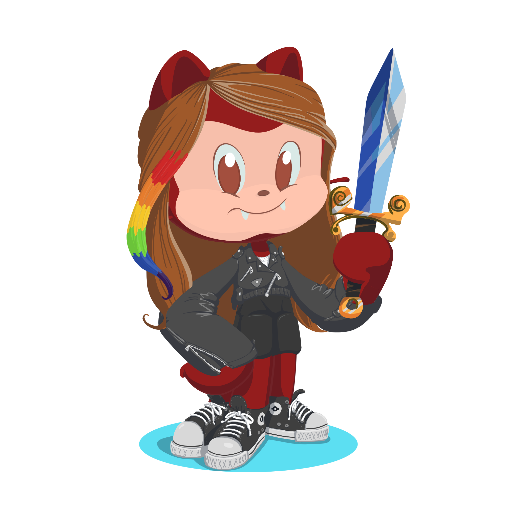

<h2>
  Olá! Eu sou o Chae 🫰
  
  
</h2>

---

### 📸 Sobre mim

Oi, eu sou o **Chae** ✨  
Profissional **gênero fluido** (meus pronomes são *ele/dele*).  
Sou **desenvolvedor front-end**, **indie dev de games 2D** (me encontra no [itch.io](https://itch.io/profile/chaejiin)), e **redator publicitário**.  

Amo **literatura brasileira** e autores independentes 📚.  
Atualmente, trabalho na **Black&CO**, escrevendo sobre **games, livros, tecnologia e eventos**.  
Estou aprendendo **C#**, **HTML**, **CSS** e **JavaScript**.  

---

### 🚀 Skills

  
  
  
  

---

### 🌐 Onde me encontrar
  

---

✨ Obrigado pela visita 
